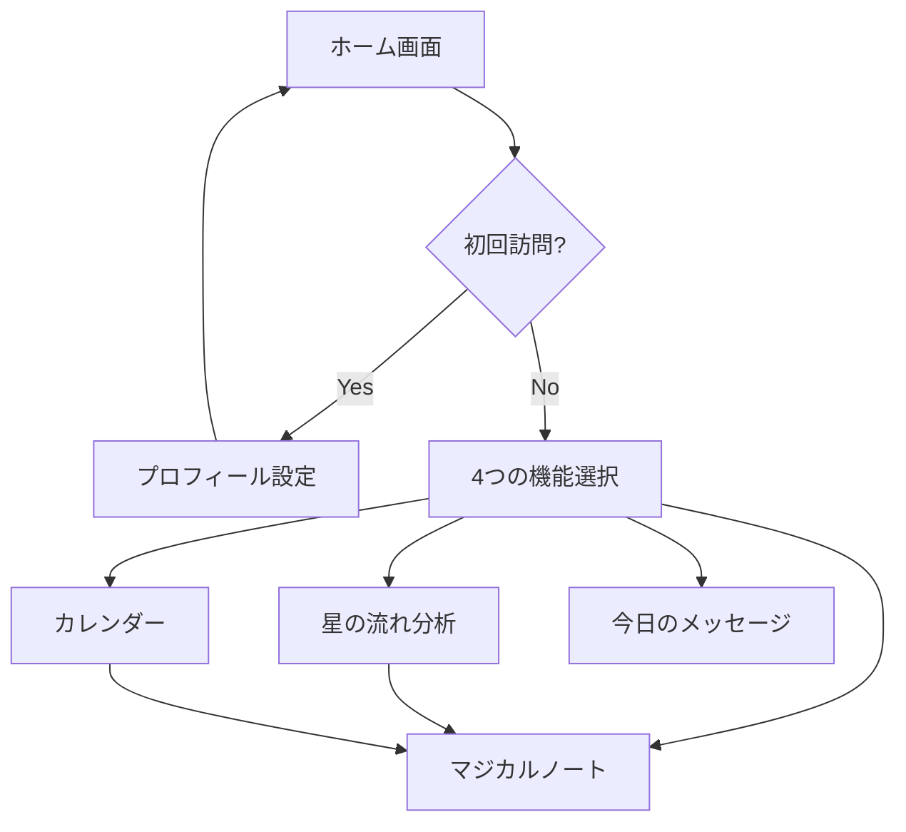

# 幻の銀水晶 - 画面モックアップ設計書

## 全体の画面構成

```
┌─────────────────────────────────────┐
│         ホーム画面                   │
│  ・今日の星の流れ                   │
│  ・マジカルメッセージ               │
│  ・4つの主要機能へのナビゲーション   │
└─────────┬───────────────────────────┘
          │
    ┌─────┴─────┬─────────┬────────┐
    ▼           ▼         ▼        ▼
┌──────────┐┌──────────┐┌────────┐┌─────────┐
│プロフィール││ 星の流れ  ││ノート術││カレンダー│
│   設定    ││   分析    ││ ガイド ││  機能   │
└──────────┘└──────────┘└────────┘└─────────┘
```

## 1. ホーム画面
### デザインコンセプト
- セーラームーン風の幻想的な世界観
- 紫〜ピンクのグラデーション背景に星空
- 月と星のモチーフを随所に配置

### 主要要素
1. **ヘッダー部分**
   - タイトル「幻の銀水晶」（装飾的なフォント）
   - 現在の月相アイコン表示

2. **今日のメッセージエリア**
   - 時間帯に応じた挨拶
   - 今日の月相情報
   - AIが生成する直感メッセージ（1〜2行）

3. **4つの機能カード**
   - 星の流れ分析（黄色い星アイコン）
   - マジカルノート（ピンクの本アイコン）
   - 月のリズム（藍色の月アイコン）
   - 今日のメッセージ（紫のキラキラアイコン）

4. **CTA（コールトゥアクション）**
   - 「星読みの旅を始める」ボタン

## 2. プロフィール設定画面
### 初回登録フロー
```
[生年月日入力]
    ↓
[出生時間入力（任意）]
    ↓
[出生地入力（任意）]
    ↓
[確認画面]
```

### UI要素
- 日付ピッカー（生年月日）
- 時刻選択（0〜23時、0〜59分）
- 場所検索（都道府県/市区町村）
- 「銀水晶に記憶する」ボタン

## 3. 星の流れ分析画面
### レイアウト
```
┌─────────────────────────┐
│  あなたの星座：◯◯座    │
│  月星座：△△座         │
├─────────────────────────┤
│  今後の重要な節目       │
│  ・3/15 変容の時期      │
│  ・3/28 拡大のチャンス   │
│  ・4/10 内省と浄化      │
├─────────────────────────┤
│  [詳細を見る] [ノート作成]│
└─────────────────────────┘
```

### 表示内容
- 基本的な星座情報
- 今後3ヶ月の重要な節目リスト
- 各節目のテーマ（キーワード表示）

## 4. マジカルノート画面
### 構成要素
1. **AIからの問いかけ**
   ```
   「今の星の流れは〈変容〉のエネルギー。
    何を手放し、何を受け入れますか？」
   ```

2. **ノート記入エリア**
   - テキストエリア（最低5行）
   - 象徴選択（月、星、花、水晶など）
   - 意図の明確化フィールド

3. **アクションボタン**
   - 「宇宙に願いを送る」
   - 「下書き保存」
   - 「過去のノートを見る」

## 5. カレンダー画面
### ビジュアル
```
2025年3月
月 火 水 木 金 土 日
                1  2
 3  4  5  6  7  8  9
10 11 12 13 14 15 16
17 18 19 20 21 22 23
24 25 26 27 28 29 30
31

凡例：
🌑 新月  🌕 満月  
⭐ 重要な節目  📝 ノート記入日
```

### 機能
- 月相の表示
- 星の節目をアイコンで表示
- タップで詳細情報表示
- ノート作成への導線

## 6. 画面遷移フロー


## 7. デザイン仕様
### カラーパレット
- 背景：#0a0014（深い紺色）〜 #4B0082（インディゴ）〜 #DA70D6（オーキッド）
- テキスト：#F0E6FF（薄紫）、#FFB6C1（ライトピンク）
- アクセント：#FFD700（ゴールド）、#FF69B4（ホットピンク）

### フォント
- 見出し：Noto Serif JP（明朝体）
- 本文：ヒラギノ角ゴ or メイリオ

### アニメーション
- カードホバー時：わずかな拡大とグロー効果
- ボタン：押下時にキラキラエフェクト
- 背景：ゆっくりと動く星のパーティクル

## 8. レスポンシブ対応
- モバイルファースト設計
- ブレイクポイント：
  - モバイル：〜767px
  - タブレット：768px〜1023px
  - デスクトップ：1024px〜

## 9. 次のステップ
1. このモックアップを元にユーザーヒアリング実施
2. フィードバックを反映して詳細設計
3. プロトタイプ実装
4. ユーザビリティテスト